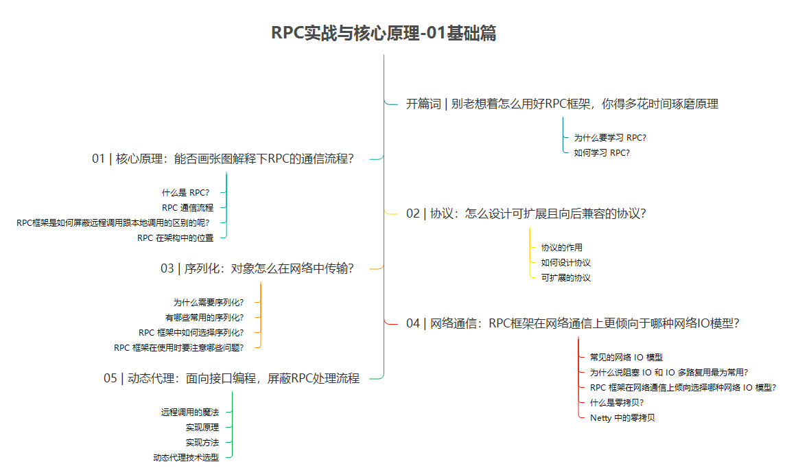

# 目录



# 开篇词 | 别老想着怎么用好RPC框架，你得多花时间琢磨原理

**为什么要学习 RPC?**

RPC 是微服务的基础。那 RPC 是不是只应用在微服务当中呢？

当然不是，只要涉及到网络通信，就可能用到 RPC。比如 etcd，它作为一个统一的配置服务，客户端就是通过 gRPC 框架与服务端进行通信的。

RPC 是解决分布式系统通信问题的一大利器。

网络通信是搭建分布式系统的一个大难题，而 RPC 对网络通信的整个过程做了完整包装，在搭建分布式系统时，它会使网络通信逻辑的开发变得更加简单，同时也会让网络通信变得更加安全可靠。

**如何学习 RPC?**

逐步深入。RPC 可以解决通信问题，这时我们肯定要去学序列化、编解码以及网络传输这些内容。这些只是 RPC 的基础。

RPC 真正强大的地方是它的治理功能，比如连接管理、健康检测、负载均衡、优雅启停、异常重试、业务分组以及熔断限流等等。

**专栏设置**

基础篇：RPC 的基本原理以及它的基本功能模块。（01-06）

进阶篇：RPC 框架的架构设计，以及 RPC 框架集群、治理相关的知识。（07-16）（关注作者遇到的问题与解决方案）

高级篇：RPC 性能优化、线上问题排查以及特色功能设计。（17-24）

------

基础篇

# 01 | 核心原理：能否画张图解释下RPC的通信流程？

> 本讲内容：RPC 定义，它要解决的问题，工作原理

**什么是 RPC？** 

RPC 的全称是 Remote Procedure Call，即远程过程调用。 

RPC 的作用就是体现在这样两个方面：<br>屏蔽远程调用跟本地调用的区别，让我们感觉就是调用项目内的方法；<br>隐藏底层网络通信的复杂性，让我们更专注于业务逻辑。 

**RPC 通信流程**

RPC 一般默认采用 TCP 来传输。 

网络传输的数据必须是二进制数据，需要提前把对象数据转成可传输的二进制，并且要求转换算法是可逆的，这个过程我们一般叫做“序列化”。 

数据格式的约定内容叫做“协议”。大多数的协议会分成两部分，分别是数据头和消息体。数据头一般用于身份识别，包括协议标识、数据大小、请求类型、序列化类型等信息；消息体主要是请求的业务参数信息和扩展属性等。 

根据协议格式，服务提供方就可以正确地从二进制数据中分割出不同的请求来，同时根据请求类型和序列化类型，把二进制的消息体逆向还原成请求对象。这个过程叫作“反序列化” 。

服务提供方再根据反序列化出来的请求对象找到对应的实现类，完成真正的方法调用 。

然后把执行结果序列化后，回写到对应的 TCP 通道里面。调用方获取到应答的数据包后，再反序列化成应答对象，这样调用方就完成了一次 RPC 调用。 

**RPC框架是如何屏蔽远程调用跟本地调用的区别的呢？**

由服务提供者给出业务接口声明，在调用方的程序里面，RPC 框架根据调用的服务接口提前生成动态代理实现类，并通过依赖注入等技术注入到声明了该接口的相关业务逻辑里面。

该代理实现类会拦截所有的方法调用，在提供的方法处理逻辑里面完成一整套的远程调用，并把远程调用结果返回给调用方，这样调用方在调用远程方法的时候就获得了像调用本地接口一样的体验。 


**RPC 在架构中的位置**

利用 RPC 我们不仅可`以很方便地将应用架构从“单体”演进成“微服务化”，而且还能解决实际开发过程中的效率低下、系统耦合等问题，这样可以使得我们的系统架构整体清晰、健壮，应用可运维度增强。

RPC 不仅可以用来解决通信问题，它还被用在了很多其他场景，比如：发 MQ、分布式缓存、数据库等。


由此可以，RPC 确实是我们日常开发中经常接触的东西，只是被包装成了各种框架，导致我们很少意识到这就是 RPC。

# 02 | 协议：怎么设计可扩展且向后兼容的协议？

> 本讲内容：RPC 协议
>

我们可以先了解下 HTTP 协议，如下图所示：


**协议的作用**

在传输过程中，RPC 并不会把请求参数的所有二进制数据整体一下子发送到对端机器上，中间可能会拆分成好几个数据包，也可能会合并其他请求的数据包。对于服务提供方应用来说，他会从 TCP 通道里面收到很多的二进制数据，那这时候怎么识别出哪些二进制是第一个请求的呢？

我们需要在发送请求的时候设定一个边界，然后在收到请求的时候按照这个设定的边界进行数据分割。这个边界语义的表达，就是我们所说的协议。

**如何设计协议**

有了现成的 HTTP 协议，为啥不直接用，还要为 RPC 设计私有协议呢？”

1. RPC 更多的是负责应用间的通信，所以性能要求相对更高。但 HTTP 协议的数据包大小相对请求数据本身要大很多，需要加入很多无用的内容，比如换行符号、回车符等；
2. HTTP 协议属于无状态协议，客户端无法对请求和响应进行关联，每次请求都需要重新建立连接，响应完成后再关闭连接。

因此，对于要求高性能的 RPC 来说，HTTP 协议基本很难满足需求，所以 RPC 会选择设计更紧凑的私有协议。

那怎么设计一个私有 RPC 协议呢？ 

在设计协议前，我们先梳理下要完成 RPC 通信的时候，在协议里面需要放哪些内容。

1. 消息边界

   RPC 每次发请求发的大小都是不固定的，所以我们的协议必须能让接收方正确地读出不定长的内容。

   

2. 序列化方式

   如果不能知道调用方用的序列化方式，即使服务提供方还原出了正确的语义，也并不能把二进制还原成对象。

这样整个协议就会拆分成两部分：协议头和协议体。

在协议头里面，我们除了会放协议长度、序列化方式，还会放一些像协议标示、消息 ID、消息类型这样的参数，而协议体一般只放请求接口方法、请求的业务参数值和一些扩展属性。

这样一个完整的 RPC 协议大概就出来了，协议头是由一堆固定的长度参数组成，而协议体是根据请求接口和参数构造的，长度属于可变的，具体协议如下图所示：


**可扩展的协议**

刚才讲的协议属于定长协议头，那也就是说往后就不能再往协议头里加新参数了，如果加参数就会导致线上兼容问题。

那我把参数加在不定长的协议体里面行不行？

协议体里面的内容都是经过序列化出来的，也就是说你要获取到你参数的值，就必须把整个协议体里面的数据经过反序列化出来。但在某些场景下，这样做的代价有点高啊！

所以为了保证能平滑地升级改造前后的协议，我们有必要设计一种支持可扩展的协议。整体协议就变成了三部分内容：固定部分、协议头内容、协议体内容。具体协议如下：


设计一个简单的 RPC 协议并不难，难的是怎么去设计一个可扩展的协议。

**课后思考**

今天我们讨论过 RPC 不直接用 HTTP 协议的一个原因是无法实现请求跟响应关联，每次请求都需要重新建立连接，响应完成后再关闭连接，所以我们要设计私有协议。那么在 RPC 里面，我们是怎么实现请求跟响应关联的呢？

答：以 Dubbo 为例，消费者发送请求时，使用 AtomicLong 自增，产生一个 消息 ID。消费者会将消息 ID 保存到 Map 结构中。为了保证请求响应可以一一对应，这就需要提供者返回的响应信息带上请求者消息 ID。 通过响应的消息 ID，就能找到对应的请求。

（这种情况比较像之前做过的 pdf 拆分进度条的实现。）

# 03 | 序列化：对象怎么在网络中传输？

> 本讲内容：RPC 序列化

**为什么需要序列化？**

网络传输的数据必须是二进制数据，但调用方请求的出入参数都是对象。


**有哪些常用的序列化？**

1. JDK 原生序列化

   JDK 自带的序列化具体的实现是由 ObjectOutputStream 完成的，而反序列化的具体实现是由 ObjectInputStream 完成的。

   JDK 的序列化过程是怎样完成的呢？我们看下面这张图：

   

   序列化过程就是在读取对象数据的时候，不断加入一些特殊分隔符，用于在反序列化过程中截断作用。

   头部数据用来声明序列化协议、序列化版本，用于高低版本向后兼容；

   对象数据主要包括类名、签名、属性、属性值，除了属性值属于真正的对象值，其他都是为了反序列化用的元数据；

   存在对象引用、继承的情况下，就是递归遍历“写对象”逻辑。

2. JSON

   JSON 进行序列化的额外空间开销比较大，耗费内存和磁盘；

   JSON 没有类型，需要通过反射统一解决，性能不会太好；

3. Hessian

   Hessian 是动态类型、二进制、紧凑的，并且可跨语言移植的一种序列化框架。

   使用示例如下：

   ```java
   Student student = new Student();
   student.setNo(101);
   student.setName("HESSIAN");
   
   // 把 student 对象转化为 byte 数组
   ByteArrayOutputStream bos = new ByteArrayOutputStream();
   Hessian2Output output = new Hessian2Output(bos);
   output.writeObject(student);
   output.flushBuffer();
   byte[] data = bos.toByteArray();
   bos.close();
   
   // 把刚才序列化出来的 byte 数组转化为 student 对象
   ByteArrayInputStream bis = new ByteArrayInputStream(data);
   Hessian2Input input = new Hessian2Input(bis);
   Student deStudent = (Student) input.readObject();
   input.close();
   
   System.out.println(deStudent);
   ```

   Hessian 本身也有问题，官方版本对 Java 里面一些常见对象的类型不支持，比如：

   - Linked系列。LinkedHashMap、LinkedHashSet 等，可通过扩展 CollectionDeserializer 类修复；

   - Locale类。可以通过扩展 ContextSerializerFactory 类修复；

   - Byte/Short 反序列化的时候变成 Integer。

4. Protobuf

   Protobuf 使用的时候需要定义 IDL(Interface description language)，然后使用不同语言的 IDL 编译器，生成序列化工具类，它的优点是：

   - 体积小；
   - 语义描述清晰；
   - 序列化反序列化速度快，不需要通过反射获取类型；
   - 兼容性好；

   使用代码示例如下：

   ```java
   /**
    * // IDL 文件格式
    * synax = "proto3";
    * option java_package = "com.test";
    * option java_outer_classname = "StudentProtobuf";
    * 
    * message StudentMas {
    *   // 序号
    *   int32 no = 1;
    *   // 姓名
    *   string name = 2;
    * }
    *
    */
   
   StudentProtobuf.StudentMsg.Builder builder = StudentProtobuf.StudentMsg.newBuilder();
   builder.setNo(103);
   builder.setName("protobuf");
   
   // 把student 对象转化为byte数组
   StudentProtobuf.StudentMsg msg = builder.build();
   byte[] data = msg.toByteArray();
   
   // 把刚才序列化出来的byte 数组转化为student 对象
   StudentProtobuf.StudentMsg deStudent = StudentProtobuf.StudentMsg.parseFrom(data);
   
   System.out.println(deStudent);
   ```
   
   Protostuff 不需要依赖 IDL 文件，可以直接对 Java 邻域对象进行反/序列化操作，在效率上跟 Protobuf 差不多，生成的二进制格式和 Protobuf 是完全相同的，可以说是一个 Java 版本的 Protobuf 序列化框架。但也有一些不支持的情况：

   - 不支持null；
   - Protostuff 不支持单纯的 Map、List 集合对象，需要包在对象里面。

**RPC 框架中如何选择序列化？**

1. 性能和效率。
2. 空间开销，序列化后的二进制数据体积。
3. 通用性和兼容性，支持升级 RPC 版本。
4. 安全性。


**RPC 框架在使用时要注意哪些问题？**

1. 对象不要构造得过于复杂。会影响性能
2. 对象不要过于庞大。
3. 避免使用序列化框架不支持的类作为入参类。
4. 避免对象有复杂的继承关系。会影响性能

# 04 | 网络通信：RPC框架在网络通信上更倾向于哪种网络IO模型？ 

> 参考资料：https://blog.csdn.net/tjiyu/article/details/52959418

**常见的网络 IO 模型**

常见的网络 IO 模型分为四种：同步阻塞 IO（BIO）、同步非阻塞 IO（NIO）、IO 多路复用和异步非阻塞 IO（AIO）。在这四种 IO 模型中，只有 AIO 为异步 IO，其他都是同步IO 。

其中，最常用的就是同步阻塞 IO 和 IO 多路复用 。

1. 阻塞 IO（blocking IO） 

   首先，应用进程发起 IO 系统调用后，应用进程被阻塞，转到内核空间处理。之后，内核开始等待数据，等待到数据之后，再将内核中的数据拷贝到用户内存中，整个 IO 处理完毕后返回进程。最后应用的进程解除阻塞状态，运行业务逻辑。 

   

   这里我们可以看到，系统内核处理 IO 操作分为两个阶段——等待数据和拷贝数据。而在这两个阶段中，应用进程中 IO 操作的线程会一直都处于阻塞状态，如果是基于 Java 多线程开发，那么每一个 IO 操作都要占用线程，直至 IO 操作结束。 

2. IO 多路复用（IO multiplexing）

   多路就是指多个通道，也就是多个网络连接的 IO，而复用就是指多个通道复用在一个复用器上。

   多路复用 IO 是在高并发场景中使用最为广泛的一种 IO 模型，如 Java 的 NIO、Redis、Nginx 的底层实现就是此类 IO 模型的应用，经典的 Reactor 模式也是基于此类 IO 模型。

   多个网络连接的 IO 可以注册到一个复用器（select）上，当用户进程调用了 select，那么整个进程会被阻塞。同时，内核会“监视”所有 select 负责的 socket，当任何一个socket 中的数据准备好了，select 就会返回。这个时候用户进程再调用 read 操作，将数据从内核中拷贝到用户进程。

   

   整个流程要比阻塞 IO 要复杂，似乎也更浪费性能。但它最大的优势在于，用户可以在一个线程内同时处理多个 socket 的 IO 请求。用户可以注册多个 socket，然后不断地调用 select 读取被激活的socket，即可达到在同一个线程内同时处理多个 IO 请求的目的。而在同步阻塞模型中，必须通过多线程的方式才能达到这个目的。IO 复用避免了上下文切换带来的性能开销。

补充：

3. 同步非阻塞 IO

   进程发起 IO 系统调用后，如果内核缓冲区没有数据，需要到 IO 设备中读取，进程返回一个错误而不会被阻塞；进程发起 IO 系统调用后，如果内核缓冲区有数据，内核就会把数据返回进程。
   
   

4. 信号驱动 IO 模型：

   当进程发起一个 IO 操作，会向内核注册一个信号处理函数，然后进程返回不阻塞；当内核数据就绪时会发送一个信号给进程，进程便在信号处理函数中调用 IO 读取数据。
   
   

5. 异步非阻塞 IO

   当进程发起一个 IO 操作，进程返回（不阻塞），但也不能返回结果；内核把整个 IO 处理完后，会通知进程结果。如果 IO 操作成功则进程直接获取到数据。
   
   

**为什么说阻塞 IO 和 IO 多路复用最为常用？**

在网络 IO 的应用上，需要的是系统内核的支持以及编程语言的支持。 

在系统内核的支持上，现在大多数系统内核都会支持阻塞 IO、非阻塞 IO 和 IO 多路复用，但像信号驱动 IO、异步 IO，只有高版本的 Linux 系统内核才会支持。 

在编程语言上，无论 C++ 还是 Java，在高性能的网络编程框架的编写上，大多数都是基于 Reactor 模式，而 Reactor 模式是基于 IO多路复用的。 

**RPC 框架在网络通信上倾向选择哪种网络 IO 模型？**

在网络通信的处理上，会选择 IO 多路复用的方式。 

开发语言的网络通信框架的选型上，我们最优的选择是基于Reactor 模式实现的框架。

**什么是零拷贝？**

刚才讲阻塞 IO 的时候我讲到，系统内核处理 IO 操作分为两个阶段——等待数据和拷贝数据。等待数据，就是系统内核在等待网卡接收到数据后，把数据写到内核中；而拷贝数据，就是系统内核在获取到数据后，将数据拷贝到用户进程的空间中。以下是具体流程： 


应用进程的每一次写操作，都会把数据写到用户空间的缓冲区中，再由 CPU 将数据拷贝到系统内核的缓冲区中，之后再由 DMA 将这份数据拷贝到网卡中，最后由网卡发送出去。

应用进程的一次完整的读写操作，都需要在用户空间与内核空间中来回拷贝，并且每一次拷贝，都需要 CPU 进行一次上下文切换（由用户进程切换到系统内核，或由系统内核切换到用户进程），这样是不是很浪费 CPU 和性能呢？那有没有什么方式，可以减少进程间的数据拷贝，提高数据传输的效率呢？ 

这时我们就需要零拷贝（Zero-copy）技术。 

所谓的零拷贝，就是取消用户空间与内核空间之间的数据拷贝操作，应用进程每一次的读写操作，可以通过一种方式，直接将数据写入内核或从内核中读取数据，再通过 DMA 将内核中的数据拷贝到网卡，或将网卡中的数据 copy 到内核。 

那怎么做到零拷贝？你想一下是不是用户空间与内核空间都将数据写到一个地方，就不需要拷贝了？此时你有没有想到虚拟内存？ 零拷贝有两种解决方式，分别是 mmap+write 方式和 sendfile 方式，其核心原理都是通过虚拟内存来解决的。 


**Netty 中的零拷贝**

反序列化操作过程中，有组包的操作，会有用户空间内部内存中的拷贝处理操作。Netty 的零拷贝就是为了解决这个问题，在用户空间对数据操作进行优化。

那么 Netty 是怎么对数据操作进行优化的呢？

- Netty 提供了 CompositeByteBuf 类，它可以将多个 ByteBuf 合并为一个逻辑上的 ByteBuf，避免了各个 ByteBuf 之间的拷贝。
- ByteBuf 支持 slice 操作，因此可以将 ByteBuf 分解为多个共享同一个存储区域的 ByteBuf，避免了内存的拷贝。
- 通过 wrap 操作，我们可以将 byte[] 数组、ByteBuf、ByteBuffer 等包装成一个 Netty ByteBuf 对象，进而避免拷贝操作。

Netty 框架中很多内部的 ChannelHandler 实现类，都是通过 CompositeByteBuf、slice、wrap 操作来处理 TCP 传输中的拆包与粘包问题的。

Netty 的 ByteBuffer 可以采用 Direct Buffers，使用堆外直接内存进行 Socket 的读写操作，最终的效果与虚拟内存所实现的效果是一样的。

Netty 还提供 FileRegion 中包装 NIO 的 FileChannel.transferTo() 方法实现了零拷贝，这与 Linux 中的 sendfile 方式在原理上也是一样的。

（Netty 这一块知识可以先了解一下，后面学习再深入）

# 05 | 动态代理：面向接口编程，屏蔽RPC处理流程

**远程调用的魔法**

RPC 会自动给接口生成一个代理类，当我们在项目中注入接口的时候，运行过程中实现绑定的是这个接口生成的代理类。这样在接口方法被调用的时候，它实际上是被生成的代理类拦截了，这样我们就可以在生成的代理类里面，加入远程调用逻辑。

**实现原理**

回顾一下 JDK 的动态代理实现。

```java
public class TestProxy {
	public static void main(String[] args) {
        // 构建代理器
        JDKProxy proxy = new JDKProxy(new RealHello());
        ClassLoader classLoader = ClassLoaderUtils.getCurrentClassLoader();
        // 把生成的代理类保存到文件
        System.setProperty("sun.misc.ProxyGenerator.saveGeneratedFiles", "true");
        // 生成代理类
        Hello test = (Hello) Proxy.newProxyInstance(classLoader, new Class[] {Hello.class});
        // 方法调用
        System.out.println(test.say());
    }、
}
```

我们来看下`Proxy.newProxyInstance`里面究竟发生了什么？

下面的流程图是按照 1.7.X 版本梳理的：


**实现方法**

除了 JDK 默认的 invocationHandler 能完成代理功能，还有其他的第三方框架也可以，比如像 Javassist、Byte Buddy 这样的框架。

Javassist 是能够操纵底层字节码，通过 Javassist 生成字节码，不需要通过反射完成方法调用，所以性能更好。

相比Javassist，Byte Buddy 提供了更容易操作的 API，编写的代码可读性更高。更重要的是，生成的代理类执行速度比 Javassist 更快。

**动态代理技术选型**

可以从三个角度去考虑：

- 生成代理类的速度、生成代理类的字节码大小等；
- 生成的代理类的执行效率；
- 使用是否方便，比如：API 是否易用、社区活跃度、依赖复杂度等；

**思考**

如果没有动态代理帮我们完成方法调用拦截，用户该怎么完成 RPC 调用？

答：使用静态代理。

