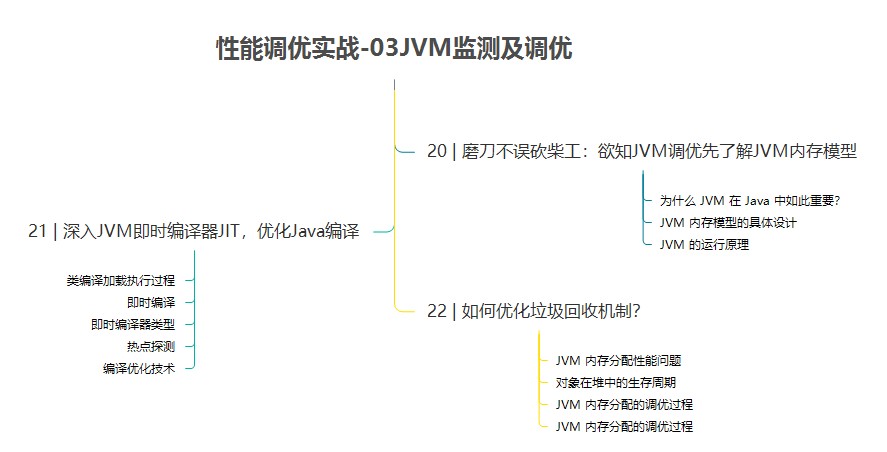

# 目录



------

模块四（20-25），JVM 性能监测及调优。

# 20 | 磨刀不误砍柴工：欲知JVM调优先了解JVM内存模型

面试中总会有人问到：请你讲解下 JVM 的内存模型，JVM 的性能调优做过吗？

**为什么 JVM 在 Java 中如此重要？**

JVM 不仅承担了 Java 字节码的分析（JIT compiler）和执行（Runtime），同时也内置了自动内存分配管理机制。

**JVM 内存模型的具体设计**

（这里注意区分Java内存模型JMM）

要进行 JVM 层面的调优，就需要深入了解 JVM 内存分配和回收原理，这样在遇到问题时，我们才能通过日志分析快速地定位问题；也能在系统遇到性能瓶颈时，通过分析 JVM 调优来优化系统性能。

JVM 内存模型主要分为堆、程序计数器、方法区、虚拟机栈和本地方法栈。


1. 堆（Heap）

   在 Java 6 版本中，永久代在非堆内存区；

   到了 Java 7 版本，永久代的静态变量和运行时常量池被合并到了堆中；

   而到了 Java 8，永久代被元空间取代了。 结构如下图所示：

   

   Java 8 为什么使用元空间替代永久代，这样做有什么好处呢？

   官方给出的解释是：

   - 移除永久代是为了融合 HotSpot JVM 与 JRockit VM 而做出的努力，因为 JRockit 没有永久代，所以不需要配置永久代。
   - 永久代内存经常不够用或发生内存溢出，爆出异常 java.lang.OutOfMemoryError: PermGen。

2. 方法区（Method Area）

   方法区主要是用来存放已被虚拟机加载的类相关信息，包括类信息、运行时常量池、字符串常量池。类信息又包括了类的版本、字段、方法、接口和父类等信息。

3. 程序计数器（Program Counter Register）

   程序计数器是一块很小的内存空间，主要用来记录各个线程执行的字节码的地址，例如，分支、循环、跳转、异常、线程恢复等都依赖于计数器。

4. 虚拟机栈（VM stack）

   当创建一个线程时，会在虚拟机栈中申请一个线程栈，用来保存方法的局部变量、操作数栈、动态链接方法和返回地址等信息，并参与方法的调用和返回。每一个方法的调用都伴随着栈帧的入栈操作，方法的返回则是栈帧的出栈操作。

5. 本地方法栈（Native Method Stack）

   本地方法栈跟 Java 虚拟机栈的功能类似，Java 虚拟机栈用于管理 Java 函数的调用，而本地方法栈则用于管理本地方法的调用。但本地方法并不是用 Java 实现的，而是由 C 语言实现的。

**JVM 的运行原理**

接下来，我们通过一个案例来了解下代码和对象是如何分配存储的，Java 代码又是如何在 JVM 中运行的。

```java
public class JVMCase {
	// 常量
	public final static String MAN_SEX_TYPE = "man";
	// 静态变量
	public static String WOMAN_SEX_TYPE = "woman";
 
	public static void main(String[] args) {
		Student stu = new Student();
		stu.setName("nick");
		stu.setSexType(MAN_SEX_TYPE);
		stu.setAge(20);
		
		JVMCase jvmcase = new JVMCase();
		// 调用静态方法
		print(stu);
		// 调用非静态方法
		jvmcase.sayHello(stu);
	}
	// 常规静态方法
	public static void print(Student stu) {
		System.out.println("name: " + stu.getName() + "; sex:" + stu.getSexType() + "; age:" + stu.getAge()); 
	}
	// 非静态方法
	public void sayHello(Student stu) {
		System.out.println(stu.getName() + "say: hello"); 
	}
}

@Setter
@Getter
class Student{
	String name;
	String sexType;
	int age;
}
```

当我们通过 Java 运行以上代码时，JVM 的整个处理过程如下：

1. JVM 向操作系统申请内存，并根据配置参数分配堆、栈以及方法区的内存大小；

2. class 文件加载、验证、准备以及解析。其中准备阶段会为类的静态变量分配内存，初始化为系统的初始值；

   

3. 进行最后一个初始化阶段。所有类的初始化代码，包括静态变量赋值语句、静态代码块、静态方法，收集在一起成为` <clinit>()`方法并执行。

4. 启动 main 线程，执行 main 方法。此时堆内存中会创建一个 student 对象，对象引用 student 就存放在栈中。

   

5. 此时再次创建一个 JVMCase 对象，调用 sayHello 非静态方法。

   

**思考题**

一个类中定义了`String a = "b"`和`String c = new String("b")`，请问这两个对象会分别创建在 JVM 内存模型中的哪块区域呢？

# 21 | 深入JVM即时编译器JIT，优化Java编译

把 .java 文件编译成 .class 文件的过程，这个编译我们一般称为前端编译。在运行时，JIT 或解释器会将字节码转换成机器码，这个过程就叫运行时编译。

今天我们就来学习运行时编译如何实现对 Java 代码的优化。

**类编译加载执行过程**

Java 从编译到运行的整个过程如下图所示：


1. 类编译

   我们通过 javap 反编译来看看一个 class 文件结构中主要包含了哪些信息：

   

   只要从上图中知道，编译后的字节码文件主要包括常量池和方法表集合这两部分。

   常量池主要记录的是类文件中出现的字面量以及符号引用。字面常量包括字符串常量，声明为 final 的属性以及一些基本类型的属性。符号引用包括类和接口的全限定名、类引用、方法引用以及成员变量引用等。

   方法表集合中主要包含一些方法的字节码、方法访问权限、方法名索引、描述符索引、JVM 执行指令以及属性集合等。

2. 类加载

   JDK 中的本地方法类一般由启动类加载器（BootstrapLoader）加载进来，JDK 中内部实现的扩展类一般由扩展类加载器（ExtClassLoader）实现加载，而程序中的类文件则由应用类加载器（AppClassLoader）实现加载。

3. 类连接

   验证：验证类符合 Java 规范和 JVM 规范，在保证符合规范的前提下，避免危害虚拟机安全。

   准备：为类的静态变量分配内存，初始化为系统的初始值。

   解析：将符号引用转为直接引用的过程。

4. 类初始化

   JVM 首先将执行构造器 `<clinit>`方法，编译器会在将 .java 文件编译成 .class 文件时，收集所有类初始化代码，包括静态变量赋值语句、静态代码块、静态方法，收集在一起成为 `<clinit>()`方法。

   子类初始化时会首先调用父类的 `<clinit>()`方法，再执行子类的` <clinit>()`方法。JVM 会保证 `<clinit>()`方法的线程安全，保证同一时间只有一个线程执行。

**即时编译**

在字节码转换为机器码的过程中，虚拟机中还存在着一道编译，那就是即时编译。

最初，虚拟机中的字节码是由解释器（ Interpreter ）完成编译的，当虚拟机发现某个方法或代码块的运行特别频繁的时候，就会把这些代码认定为“热点代码”。

为了提高热点代码的执行效率，在运行时，即时编译器（JIT）会把这些代码编译成与本地平台相关的机器码，并进行各层次的优化，然后保存到内存中。

**即时编译器类型**

在 HotSpot 虚拟机中，内置了两个 JIT，分别为 C1 编译器和 C2 编译器。

C1 编译器是一个简单快速的编译器，主要的关注点在于局部性的优化，适用于执行时间较短或对启动性能有要求的程序。

C2 编译器是为长期运行的服务器端应用程序做性能调优的编译器，适用于执行时间较长或对峰值性能有要求的程序。这两种即时编译也被称为 Client Compiler 和 Server Compiler。

Java7 引入了分层编译，这种方式综合了 C1 的启动性能优势和 C2 的峰值性能优势。分层编译将 JVM 的执行状态分为了 5 个层次。

（具体学习下《深入拆解JVM虚拟机》，这里不太懂）。

在 Java8 中，默认开启分层编译。如果只想开启 C2，可以关闭分层编译（-XX:-TieredCompilation），如果只想用 C1，可以在打开分层编译的同时，使用参数：-XX:TieredStopAtLevel=1。

除了这种默认的混合编译模式，我们还可以使用“-Xint”参数强制虚拟机运行于只有解释器的编译模式下，这时 JIT 完全不介入工作；我们还可以使用参数“-Xcomp”强制虚拟机运行于只有 JIT 的编译模式下。

通过 java -version 命令行可以直接查看到当前系统使用的编译模式。如下图所示：


**热点探测**

虚拟机为每个方法准备了两类计数器：方法调用计数器（Invocation Counter）和回边计数器（Back Edge Counter）。

1. 方法调用计数器

   用于统计方法被调用的次数，方法调用计数器的默认阈值在 C1 模式下是 1500 次，在 C2 模式在是 10000 次，可通过 -XX: CompileThreshold 来设定；而在分层编译的情况下，-XX: CompileThreshold 指定的阈值将失效，此时将会根据当前待编译的方法数以及编译线程数来动态调整。当方法计数器和回边计数器之和超过方法计数器阈值时，就会触发 JIT 编译器。

2. 回边计数器

   用于统计一个方法中循环体代码执行的次数，在字节码中遇到控制流向后跳转的指令称为“回边”（Back Edge），该值用于计算是否触发 C1 编译的阈值，在不开启分层编译的情况下，C1 默认为 13995，C2 默认为 10700，可通过 -XX: OnStackReplacePercentage=N 来设置；而在分层编译的情况下，-XX: OnStackReplacePercentage 指定的阈值同样会失效，此时将根据当前待编译的方法数以及编译线程数来动态调整。

   建立回边计数器的主要目的是为了触发 OSR（On StackReplacement）编译，即栈上编译。在一些循环周期比较长的代码段中，当循环达到回边计数器阈值时，JVM 会认为这段是热点代码，JIT 编译器就会将这段代码编译成机器语言并缓存，在该循环时间段内，会直接将执行代码替换，执行缓存的机器语言。

**编译优化技术**

JIT 编译运用了一些经典的编译优化技术来实现代码的优化，即通过一些例行检查优化，可以智能地编译出运行时的最优性能代码。今天我们主要来学习以下两种优化手段：

1. 方法内联

   调用一个方法通常要经历压栈和出栈。调用方法是将程序执行顺序转移到存储该方法的内存地址，将方法的内容执行完后，再返回到执行该方法前的位置。

   这种执行操作要求在执行前保护现场并记忆执行的地址，执行后要恢复现场，并按原来保存的地址继续执行。 因此，方法调用会产生一定的时间和空间方面的开销。

   那么对于那些方法体代码不是很大，又频繁调用的方法来说，这个时间和空间的消耗会很大。方法内联的优化行为就是把目标方法的代码复制到发起调用的方法之中，避免发生真实的方法调用。

   例如以下方法：

   ```java
   private int add1(int x1, int x2, int x3, int x4) {
       return add2(x1, x2) + add2(x3, x4);
   }
   private int add2(int x1, int x2) {
       return x1 + x2;
   }
   ```

   最终会被优化为：

   ```java
   private int add1(int x1, int x2, int x3, int x4) {
       return x1 + x2+ x3 + x4;
   }
   ```

   JVM 会自动识别热点方法，并对它们使用方法内联进行优化。我们可以通过 -XX:CompileThreshold 来设置热点方法的阈值。但要强调一点，热点方法不一定会被 JVM 做内联优化，如果这个方法体太大了，JVM 将不执行内联操作。而方法体的大小阈值，我们也可以通过参数设置来优化：

   - 经常执行的方法，默认情况下，方法体大小小于 325 字节的都会进行内联，我们可以通过 -XX:MaxFreqInlineSize=N 来设置大小值；
   - 不是经常执行的方法，默认情况下，方法大小小于 35 字节才会进行内联，我们也可以通过 -XX:MaxInlineSize=N 来重置大小值。

   之后我们就可以通过配置 JVM 参数来查看到方法被内联的情况：

   ```text
   -XX:+PrintCompilation // 在控制台打印编译过程信息
   -XX:+UnlockDiagnosticVMOptions // 解锁对 JVM 进行诊断的选项参数。默认是关闭的，开启后支持一些特定参数对 JVM 进行诊断
   -XX:+PrintInlining // 将内联方法打印出来
   ```

   当我们设置 VM 参数：-XX:+PrintCompilation -XX:+UnlockDiagnosticVMOptions -XX:+PrintInlining 之后，运行以下代码：

   ```java
   public static void main(String[] args) {
       for(int i = 0; i < 1000000; i++) {// 方法调用计数器的默认阈值在 C1 模式下是 1500 次，在 C2 模式在是 10000 次，我们循环遍历超过需要阈值
           add1(1,2,3,4);
       }
   }
   ```

   我们可以看到运行结果中，显示了方法内联的日志：

   

   热点方法的优化可以有效提高系统性能，一般我们可以通过以下几种方式来提高方法内联：

   - 通过设置 JVM 参数来减小热点阈值或增加方法体阈值，以便更多的方法可以进行内联，但这种方法意味着需要占用更多地内存；
   - 在编程中，避免在一个方法中写大量代码，习惯使用小方法体；
   - 尽量使用 final、private、static 关键字修饰方法，编码方法因为继承，会需要额外的类型检查。

2. 逃逸分析

   逃逸分析（Escape Analysis）是判断一个对象是否被外部方法引用或外部线程访问的分析技术，编译器会根据逃逸分析的结果对代码进行优化。

# 22 | 如何优化垃圾回收机制？

**JVM 内存分配性能问题**

JVM 内存分配不合理最直接的表现就是频繁的 GC，这会导致上下文切换等性能问题，从而降低系统的吞吐量、增加系统的响应时间。因此，如果你在线上环境或性能测试时，发现频繁的 GC，且是正常的对象创建和回收，这个时候就需要考虑调整 JVM 内存分配了，从而减少 GC 所带来的性能开销。

**对象在堆中的生存周期**

当我们新建一个对象时，对象会被优先分配到新生代的 Eden 区中，这时虚拟机会给对象定义一个对象年龄计数器（通过参数 -XX:MaxTenuringThreshold 设置）。

当 Eden 空间不足时，虚拟机将会执行一个新生代的垃圾回收（Minor GC）。这时 JVM 会把存活的对象转移到 Survivor 中，并给对象的年龄 +1。对象在 Survivor 中同样也会经历 MinorGC，每经过一次 MinorGC，对象的年龄将会 +1。

当然了，内存空间也是有设置阈值的，可以通过参数 -XX:PetenureSizeThreshold 设置直接被分配到老年代的最大对象，这时如果分配的对象超过了设置的阀值，对象就会直接被分配到老年代，这样做的好处就是可以减少新生代的垃圾回收。

**JVM 内存分配的调优过程**

我们可以通过以下命令来查看堆内存配置的默认值

- java -XX:+PrintFlagsFinal -version | grep HeapSize

  

- jmap -heap 17284

  

通过命令，我们可以获得在这台机器上启动的 JVM 默认最大堆内存为 1953MB，初始化大小为 124MB。

在 JDK1.7 中，默认情况下年轻代和老年代的比例是 1:2，可以通过–XX:NewRatio 配置。

年轻代中的 Eden 和 To Survivor、From Survivor 的比例是 8:1:1，可以通过 -XX:SurvivorRatio 配置。

在 JDK1.7 中如果开启了 -XX:+UseAdaptiveSizePolicy 配置项，JVM 将会动态调整 Java 堆中各个区域的大小以及进入老年代的年龄，–XX:NewRatio 和 -XX:SurvivorRatio 将会失效，而 JDK1.8 是默认开启 -XX:+UseAdaptiveSizePolicy 配置项的。

还有，在 JDK1.8 中，不要随便关闭 UseAdaptiveSizePolicy 配置项，除非你已经对初始化堆内存 / 最大堆内存、年轻代 / 老年代以及 Eden 区 /Survivor 区有非常明确的规划了。否则 JVM 将会分配最小堆内存，年轻代和老年代按照默认比例 1:2 进行分配，年轻代中的 Eden 和 Survivor 则按照默认比例 8:2 进行分配。这个内存分配未必是应用服务的最佳配置，因此可能会给应用服务带来严重的性能问题。

**JVM 内存分配的调优过程**

我们先使用 JVM 的默认配置，观察应用服务的运行情况，下面我将结合一个实际案例来讲述。现模拟一个抢购接口，假设需要满足一个 5W 的并发请求，且每次请求会产生 20KB 对象，我们可以通过千级并发创建一个 1MB 对象的接口来模拟万级并发请求产生大量对象的场景，具体代码如下：

```java
@RequestMapping(value = "/test1")
public String test1(HttpServletRequest request) {
    List<Byte[]> temp = new ArrayList<Byte[]>();

    Byte[] b = new Byte[1024*1024];
    temp.add(b);

    return "success";
}
```

**AB 压测**

分别对应用服务进行压力测试，以下是请求接口的吞吐量和响应时间在不同并发用户数下的变化情况：


可以看到，当并发数量到了一定值时，吞吐量就上不去了，响应时间也迅速增加。那么，在 JVM 内部运行又是怎样的呢？

**分析 GC 日志**

此时我们可以通过 GC 日志查看具体的回收日志。我们可以通过设置 VM 配置参数，将运行期间的 GC 日志 dump 下来，具体配置参数如下：

```
-XX:+PrintGCTimeStamps -XX:+PrintGCDetails -Xloggc:/log/heapTest.log
```

以下是各个配置项的说明：

- -XX:PrintGCTimeStamps：打印 GC 具体时间；
- -XX:PrintGCDetails ：打印出 GC 详细日志；
- -Xloggc: path：GC 日志生成路径。

收集到 GC 日志后，使用 GCViewer 工具打开它，进而查看到具体的 GC 日志如下：


主页面显示 FullGC 发生了 13 次，右下角显示年轻代和老年代的内存使用率几乎达到了 100%。而 FullGC 会导致 stop-the-world 的发生，从而严重影响到应用服务的性能。此时，我们需要调整堆内存的大小来减少 FullGC 的发生。

**参考指标**

我们可以将某些指标的预期值作为参考指标，上面的 GC 频率就是其中之一，那么还有哪些指标可以为我们提供一些具体的调优方向呢？

- GC 频率

  高频的 FullGC 会给系统带来非常大的性能消耗，虽然 MinorGC 相对 FullGC 来说好了许多，但过多的 MinorGC 仍会给系统带来压力。

- 内存

  这里的内存指的是堆内存大小，堆内存又分为年轻代内存和老年代内存。首先我们要分析堆内存大小是否合适，其实是分析年轻代和老年代的比例是否合适。如果内存不足或分配不均匀，会增加 FullGC，严重的将导致 CPU 持续爆满，影响系统性能。

- 吞吐量

  频繁的 FullGC 将会引起线程的上下文切换，增加系统的性能开销，从而影响每次处理的线程请求，最终导致系统的吞吐量下降。

- 延时

  JVM 的 GC 持续时间也会影响到每次请求的响应时间。

**具体调优方法**

- 调整堆内存空间减少 FullGC

  通过日志分析，堆内存基本被用完了，而且存在大量 FullGC，这意味着我们的堆内存严重不足，这个时候我们需要调大堆内存空间。

  ```text
  java -jar -Xms4g -Xmx4g heapTest-0.0.1-SNAPSHOT.jar
  ```

  以下是各个配置项的说明：

  - -Xms：堆初始大小；
  - -Xmx：堆最大值。

  调大堆内存之后，我们再来测试下性能情况，发现吞吐量提高了 40% 左右，响应时间也降低了将近 50%。

  

  再查看 GC 日志，发现 FullGC 频率降低了，老年代的使用率只有 16% 了。

  

- 调整年轻代减少 MinorGC

  通过调整堆内存大小，我们已经提升了整体的吞吐量，降低了响应时间。那还有优化空间吗？我们还可以将年轻代设置得大一些，从而减少一些 MinorGC。

  ```text
  java -jar -Xms4g -Xmx4g -Xmn3g heapTest-0.0.1-SNAPSHOT.jar
  ```

  再进行 AB 压测，发现吞吐量上去了。

  

  再查看 GC 日志，发现 MinorGC 也明显降低了，GC 花费的总时间也减少了。

  

- **设置 Eden、Survivor 区比例**

  在 JVM 中，如果开启 AdaptiveSizePolicy，则每次 GC 后都会重新计算 Eden、From Survivor 和 To Survivor 区的大小，计算依据是 GC 过程中统计的 GC 时间、吞吐量、内存占用量。这个时候 SurvivorRatio 默认设置的比例会失效。

  在 JDK1.8 中，默认是开启 AdaptiveSizePolicy 的，我们可以通过 -XX:-UseAdaptiveSizePolicy 关闭该项配置，或显示运行 -XX:SurvivorRatio=8 将 Eden、Survivor 的比例设置为 8:2。大部分新对象都是在 Eden 区创建的，我们可以固定 Eden 区的占用比例，来调优 JVM 的内存分配性能。

  再进行 AB 性能测试，我们可以看到吞吐量提升了，响应时间降低了。

  

  

**总结**

JVM 内存调优通常和 GC 调优是互补的，基于以上调优，我们可以继续对年轻代和堆内存的垃圾回收算法进行调优。这里可以结合上一讲的内容，一起完成 JVM 调优。

虽然分享了一些 JVM 内存分配调优的常用方法，但我还是建议你在进行性能压测后如果没有发现突出的性能瓶颈，就继续使用 JVM 默认参数，起码在大部分的场景下，默认配置已经可以满足我们的需求了。但满足不了也不要慌张，结合今天所学的内容去实践一下，相信你会有新的收获。

**思考题**

以上我们都是基于堆内存分配来优化系统性能的，但在 NIO 的 Socket 通信中，其实还使用到了堆外内存来减少内存拷贝，实现 Socket 通信优化。你知道堆外内存是如何创建和回收的吗？

