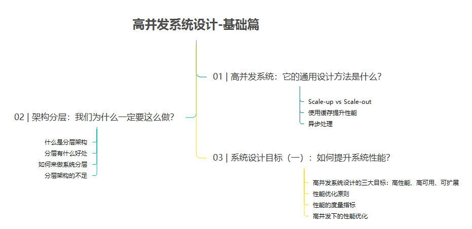

# 目录



------

基础篇（01-06）

# 01 | 高并发系统：它的通用设计方法是什么？

我们在应对高并发大流量时也会采用类似“抵御洪水”的方案，归纳起来共有三种方法。

- Scale-out（横向扩展）：分而治之是一种常见的高并发系统设计方法，采用分布式部署的方式把流量分流开，让每个服务器都承担一部分并发和流量。
- 缓存：使用缓存来提高系统的性能，就好比用“拓宽河道”的方式抵抗高并发大流量的冲击。
- 异步：在某些场景下，未处理完成之前，我们可以让请求先返回，在数据准备好之后再通知请求方，这样可以在单位时间内处理更多的请求。

**Scale-up vs Scale-out**

著名的“摩尔定律”是由 Intel 的创始人之一戈登·摩尔于 1965 年提出的。这个定律提到，集成电路上可容纳的晶体管的数量约每隔两年会增加一倍。

我们在高并发系统设计上也沿用了同样的思路，将类似追逐摩尔定律不断提升 CPU 性能的方案叫做 Scale-up（纵向扩展），把类似 CPU 多核心的方案叫做 Scale-out，这两种思路在实现方式上是完全不同的。

- Scale-up，通过购买性能更好的硬件来提升系统的并发处理能力，比方说目前系统 4 核 4G 每秒可以处理 200 次请求，那么如果要处理 400 次请求呢？很简单，我们把机器的硬件提升到 8 核 8G（硬件资源的提升可能不是线性的，这里仅为参考）。
- Scale-out，则是另外一个思路，它通过将多个低性能的机器组成一个分布式集群来共同抵御高并发流量的冲击。沿用刚刚的例子，我们可以使用两台 4 核 4G 的机器来处理那 400 次请求。

那么什么时候选择 Scale-up，什么时候选择 Scale-out 呢？

一般来讲，在我们系统设计初期会考虑使用 Scale-up 的方式，因为这种方案足够简单，所谓能用堆砌硬件解决的问题就用硬件来解决，但是当系统并发超过了单机的极限时，我们就要使用 Scale-out 的方式。

Scale-out 虽然能够突破单机的限制，但也会引入一些复杂问题。比如：

1. 如果某个节点出现故障如何保证整体可用性？
2. 当多个节点有状态需要同步时，如何保证状态信息在不同节点的一致性？
3. 如何做到使用方无感知的增加和删除节点？

等等。其中每一个问题都涉及很多的知识点，我会在后面的课程中深入地讲解，这里暂时不展开了。

**使用缓存提升性能**

Web 2.0 是缓存的时代，这一点毋庸置疑。缓存遍布在系统设计的每个角落，从操作系统到浏览器，从数据库到消息队列，任何略微复杂的服务和组件中，你都可以看到缓存的影子。我们使用缓存的主要作用是提升系统的访问性能，那么在高并发的场景下，就可以支撑更多用户的同时访问。

那么为什么缓存可以大幅度提升系统的性能呢？我们知道数据是放在持久化存储中的，一般的持久化存储都是使用磁盘作为存储介质的，而普通磁盘数据由机械手臂、磁头、转轴、盘片组成，盘片又分为磁道、柱面和扇区，盘片构造图我放在下面了。


寻道时间：盘片是存储介质，每个盘片被划分为多个同心圆，信息都被存储在同心圆之中，这些同心圆就是磁道。在磁盘工作时盘片是在高速旋转的，机械手臂驱动磁头沿着径向移动，在磁道上读取所需要的数据。我们把磁头寻找信息花费的时间叫做寻道时间。

普通磁盘的寻道时间是 10ms 左右，而相比于磁盘寻道花费的时间，CPU 执行指令和内存寻址的时间都在是 ns（纳秒）级别，从千兆网卡上读取数据的时间是在μs（微秒）级别。所以在整个计算机体系中，磁盘是最慢的一环，甚至比其它的组件要慢几个数量级。因此，我们通常使用以内存作为存储介质的缓存，以此提升性能。

当然，缓存的语义已经丰富了很多，我们可以将任何降低响应时间的中间存储都称为缓存。缓存的思想遍布很多设计领域，比如在操作系统中 CPU 有多级缓存，文件有 Page Cache 缓存，你应该有所了解。

**异步处理**

**异步**也是一种常见的高并发设计方法，我们在很多文章和演讲中都能听到这个名词，与之共同出现的还有它的反义词：同步。比如，分布式服务框架 Dubbo 中有同步方法调用和异步方法调用，IO 模型中有同步 IO 和异步 IO。

异步调用在大规模高并发系统中被大量使用，比如我们熟知的 12306 网站。当我们订票时，页面会显示系统正在排队，这个提示就代表着系统在异步处理我们的订票请求。在 12306 系统中查询余票、下单和更改余票状态都是比较耗时的操作，可能涉及多个内部系统的互相调用，如果是同步调用就会像 12306 刚刚上线时那样，高峰期永远不可能下单成功。

而采用异步的方式，后端处理时会把请求丢到消息队列中，同时快速响应用户，告诉用户我们正在排队处理，然后释放出资源来处理更多的请求。订票请求处理完之后，再通知用户订票成功或者失败。

处理逻辑后移到异步处理程序中，Web 服务的压力小了，资源占用的少了，自然就能接收更多的用户订票请求，系统承受高并发的能力也就提升了。


我建议一般系统的演进过程应该遵循下面的思路：

- 最简单的系统设计满足业务需求和流量现状，选择最熟悉的技术体系。
- 随着流量的增加和业务的变化，修正架构中存在问题的点，如单点问题，横向扩展问题，性能无法满足需求的组件。在这个过程中，选择社区成熟的、团队熟悉的组件帮助我们解决问题，在社区没有合适解决方案的前提下才会自己造轮子。
- 当对架构的小修小补无法满足需求时，考虑重构、重写等大的调整方式以解决现有的问题。

以淘宝为例，当时在业务从 0 到 1 的阶段是通过购买的方式快速搭建了系统。而后，随着流量的增长，淘宝做了一系列的技术改造来提升高并发处理能力，比如：

1. 数据库存储引擎从 MyISAM 迁移到 InnoDB；
2. 数据库做分库分表；
3. 增加缓存；
4. 启动中间件研发等。

**思考时间**

高并发系统演进是一个渐进的过程，并非一蹴而就的，你在实际工作中，在系统演进过程中积累了哪些经验又踩到了哪些坑呢？

卷宗项目遇到的问题

1. 并发问题：3万并发量下载材料LRUMap扩容问题；
2. 架构演进：材料转换服务（上传），分区分表（上传/刷新）

# 02 | 架构分层：我们为什么一定要这么做？

在系统从 0 到 1 的阶段，为了让系统快速上线，我们通常是不考虑分层的。但是随着业务越来越复杂，大量的代码纠缠在一起，会出现逻辑不清晰、各模块相互依赖、代码扩展性差、改动一处就牵一发而动全身等问题。

**什么是分层架构**

软件架构分层在软件工程中是一种常见的设计方式，它是将整体系统拆分成 N 个层次，每个层次有独立的职责，多个层次协同提供完整的功能。

MVC（Model-View-Controller）架构。它将整体的系统分成了 Model（模型），View（视图）和 Controller（控制器）三个层次，也就是将用户视图和业务处理隔离开，并且通过控制器连接起来，很好地实现了表现和逻辑的解耦，是一种标准的软件分层架构。


另外一种常见的分层方式是将整体架构分为表现层、逻辑层和数据访问层：

- 表现层，顾名思义嘛，就是展示数据结果和接受用户指令的，是最靠近用户的一层；
- 逻辑层里面有复杂业务的具体实现；
- 数据访问层则是主要处理和存储之间的交互。


 OSI 网络模型，它把整个网络分了七层，自下而上分别是物理层、数据链路层、网络层、传输层、会话层、表示层和应用层。

工作中经常能用到 TCP/IP 协议，它把网络简化成了四层，即链路层、网络层、传输层和应用层。每一层各司其职又互相帮助，网络层负责端到端的寻址和建立连接，传输层负责端到端的数据传输等，同时呢相邻两层还会有数据的交互。这样可以隔离关注点，让不同的层专注做不同的事情。


Linux 文件系统也是分层设计的。在文件系统的最上层是虚拟文件系统（VFS），用来屏蔽不同的文件系统之间的差异，提供统一的系统调用接口。虚拟文件系统的下层是 Ext3、Ext4 等各种文件系统，再向下是为了屏蔽不同硬件设备的实现细节，我们抽象出来的单独的一层——通用块设备层，然后就是不同类型的磁盘了。

我们可以看到，某些层次负责的是对下层不同实现的抽象，从而对上层屏蔽实现细节。比方说 VFS 对上层（系统调用层）来说提供了统一的调用接口，同时对下层中不同的文件系统规约了实现模型，当新增一种文件系统实现的时候，只需要按照这种模型来设计，就可以无缝插入到 Linux 文件系统中。


那么，为什么这么多系统一定要做分层的设计呢？答案是分层设计存在一定的优势。

**分层有什么好处**

1. 分层的设计可以简化系统设计，让不同的人专注做某一层次的事情。

   想象一下，如果你要设计一款网络程序却没有分层，该是一件多么痛苦的事情。

   因为你必须是一个通晓网络的全才，要知道各种网络设备的接口是什么样的，以便可以将数据包发送给它。你还要关注数据传输的细节，并且需要处理类似网络拥塞，数据超时重传这样的复杂问题。当然了，你更需要关注数据如何在网络上安全传输，不会被别人窥探和篡改。

   而有了分层的设计，你只需要专注设计应用层的程序就可以了，其他的，都可以交给下面几层来完成。

2. 再有，分层之后可以做到很高的复用。

   比如，我们在设计系统 A 的时候，发现某一层具有一定的通用性，那么我们可以把它抽取独立出来，在设计系统 B 的时候使用起来，这样可以减少研发周期，提升研发的效率。

3. 最后一点，分层架构可以让我们更容易做横向扩展。

   如果系统没有分层，当流量增加时我们需要针对整体系统来做扩展。但是，如果我们按照上面提到的三层架构将系统分层后，那么我们就可以针对具体的问题来做细致的扩展。

   比如说，业务逻辑里面包含有比较复杂的计算，导致 CPU 成为性能的瓶颈，那这样就可以把逻辑层单独抽取出来独立部署，然后只对逻辑层来做扩展，这相比于针对整体系统扩展所付出的代价就要小的多了。

**如何来做系统分层**

在我看来，最主要的一点就是你需要理清楚每个层次的边界是什么。

当业务逻辑简单时，层次之间的边界的确清晰，开发新的功能时也知道哪些代码要往哪儿写。但是当业务逻辑变得越来越复杂时，边界就会变得越来越模糊，给你举个例子。

任何一个系统中都有用户系统，最基本的接口是返回用户信息的接口，它调用逻辑层的 GetUser 方法，GetUser 方法又和 User DB 交互获取数据，就像下图左边展示的样子。

这时，产品提出一个需求，在 APP 中展示用户信息的时候，如果用户不存在，那么要自动给用户创建一个用户。同时，要做一个 HTML5 的页面，HTML5 页面要保留之前的逻辑，也就是不需要创建用户。这时逻辑层的边界就变得不清晰，表现层也承担了一部分的业务逻辑（将获取用户和创建用户接口编排起来）。


那我们要如何做呢？参照阿里发布的[《阿里巴巴 Java 开发手册 v1.4.0（详尽版）》](https://yq.aliyun.com/articles/69327)，我们可以将原先的三层架构细化成下面的样子：


我来解释一下这个分层架构中的每一层的作用。

- 终端显示层：各端模板渲染并执行显示的层。当前主要是 Velocity 渲染，JS 渲染， JSP 渲染，移动端展示等。
- 开放接口层：将 Service 层方法封装成开放接口，同时进行网关安全控制和流量控制等。
- Web 层：主要是对访问控制进行转发，各类基本参数校验，或者不复用的业务简单处理等。
- Service 层：业务逻辑层。
- Manager 层：通用业务处理层。这一层主要有两个作用，其一，你可以将原先 Service 层的一些通用能力下沉到这一层，比如与缓存和存储交互策略，中间件的接入；其二，你也可以在这一层封装对第三方接口的调用，比如调用支付服务，调用审核服务等。
- DAO 层：数据访问层，与底层 MySQL、Oracle、Hbase 等进行数据交互。
- 外部接口或第三方平台：包括其它部门 RPC 开放接口，基础平台，其它公司的 HTTP 接口。

在这个分层架构中主要增加了 Manager 层，它与 Service 层的关系是：Manager 层提供原子的服务接口，Service 层负责依据业务逻辑来编排原子接口。

以上面的例子来说，Manager 层提供创建用户和获取用户信息的接口，而 Service 层负责将这两个接口组装起来。这样就把原先散布在表现层的业务逻辑都统一到了 Service 层，每一层的边界就非常清晰了。

除此之外，分层架构需要考虑的另一个因素，是层次之间一定是相邻层互相依赖，数据的流转也只能在相邻的两层之间流转。

我们还是以三层架构为例，数据从表示层进入之后一定要流转到逻辑层，做业务逻辑处理，然后流转到数据访问层来和数据库交互。那么你可能会问：“如果业务逻辑很简单的话可不可以从表示层直接到数据访问层，甚至直接读数据库呢？”

其实从功能上是可以的，但是从长远的架构设计考虑，这样会造成层级调用的混乱，比方说如果表示层或者业务层可以直接操作数据库，那么一旦数据库地址发生变更，你就需要在多个层次做更改，这样就失去了分层的意义，并且对于后面的维护或者重构都会是灾难性的。

**分层架构的不足**

任何事物都不可能是尽善尽美的，分层架构虽有优势也会有缺陷，它最主要的一个缺陷就是增加了代码的复杂度。

有时增加一个小小的需求也需要更改所有层次上的代码，看起来增加了开发的成本，并且从调试上来看也增加了复杂度，原本如果直接访问数据库我只需要调试一个方法，现在我却要调试多个层次的多个方法。

另外一个可能的缺陷是，如果我们把每个层次独立部署，层次间通过网络来交互，那么多层的架构在性能上会有损耗。这也是为什么服务化架构性能要比单体架构略差的原因，也就是所谓的“多一跳”问题。

分层架构固然会增加系统复杂度，也可能会有性能的损耗，但是相比于它能带给我们的好处来说，这些都是可以接受的，或者可以通过其它的方案解决的。

# 03 | 系统设计目标（一）：如何提升系统性能？

提到互联网系统设计，你可能听到最多的词儿就是“三高”，也就是“高并发”“高性能”“高可用”，它们是互联网系统架构设计永恒的主题。在前两节课中，我带你了解了高并发系统设计的含义，意义以及分层设计原则，接下来，我想带你整体了解一下高并发系统设计的目标，然后在此基础上，进入我们今天的话题：如何提升系统的性能？

**高并发系统设计的三大目标：高性能、高可用、可扩展**

- 高并发：是指运用设计手段让系统能够处理更多的用户并发请求，也就是承担更大的流量。它是一切架构设计的背景和前提，脱离了它去谈性能和可用性是没有意义的。

  很显然嘛，你在每秒一次请求和每秒一万次请求，两种不同的场景下，分别做到毫秒级响应时间和五个九（99.999%）的可用性，无论是设计难度还是方案的复杂度，都不是一个级别的。

- 高性能：性能反应了系统的使用体验，想象一下，同样承担每秒一万次请求的两个系统，一个响应时间是毫秒级，一个响应时间在秒级别，它们带给用户的体验肯定是不同的。

- 可用性：可用性则表示系统可以正常服务用户的时间。我们再类比一下，还是两个承担每秒一万次的系统，一个可以做到全年不停机、无故障，一个隔三差五宕机维护，如果你是用户，你会选择使用哪一个系统呢？答案不言而喻。

- 可扩展性：流量分为平时流量和峰值流量两种，峰值流量可能会是平时流量的几倍甚至几十倍，在应对峰值流量的时候，我们通常需要在架构和方案上做更多的准备。而易于扩展的系统能在短时间内迅速完成扩容，更加平稳地承担峰值流量。

高性能、高可用和可扩展，是我们在做高并发系统设计时追求的三个目标，我会用三节课的时间，带你了解在高并发大流量下如何设计高性能、高可用和易于扩展的系统。

了解完这些内容之后，我们正式进入今天的话题：如何提升系统的性能？

**性能优化原则**

- 首先，性能优化一定不能盲目，一定是问题导向的。脱离了问题，盲目地提早优化会增加系统的复杂度，浪费开发人员的时间，也因为某些优化可能会对业务上有些折中的考虑，所以也会损伤业务。

- 其次，性能优化也遵循“八二原则”，即你可以用 20% 的精力解决 80% 的性能问题。所以我们在优化过程中一定要抓住主要矛盾，优先优化主要的性能瓶颈点。

- 再次，性能优化也要有数据支撑。在优化过程中，你要时刻了解你的优化让响应时间减少了多少，提升了多少的吞吐量。

- 最后，性能优化的过程是持续的。高并发的系统通常是业务逻辑相对复杂的系统，那么在这类系统中出现的性能问题通常也会有多方面的原因。因此，我们在做性能优化的时候要明确目标，比方说，支撑每秒 1 万次请求的吞吐量下响应时间在 10ms，那么我们就需要持续不断地寻找性能瓶颈，制定优化方案，直到达到目标为止。

在以上四个原则的指引下，掌握常见性能问题的排查方式和优化手段，就一定能让你在设计高并发系统时更加游刃有余。

**性能的度量指标**

性能优化的第三点原则中提到，对于性能我们需要有度量的标准，有了数据才能明确目前存在的性能问题，也能够用数据来评估性能优化的效果。所以明确性能的度量指标十分重要。

一般来说，度量性能的指标是系统接口的响应时间，但是单次的响应时间是没有意义的，你需要知道一段时间的性能情况是什么样的。

- 平均值

  平均值是把这段时间所有请求的响应时间数据相加，再除以总请求数。平均值可以在一定程度上反应这段时间的性能，但它敏感度比较差，如果这段时间有少量慢请求时，在平均值上并不能如实的反应。

  举个例子，假设我们在 30s 内有 10000 次请求，每次请求的响应时间都是 1ms，那么这段时间响应时间平均值也是 1ms。这时，当其中 100 次请求的响应时间变成了 100ms，那么整体的响应时间是 (100 * 100 + 9900 * 1) / 10000 = 1.99ms。你看，虽然从平均值上来看仅仅增加了不到 1ms，但是实际情况是有 1% 的请求（100/10000）的响应时间已经增加了 100 倍。**所以，平均值对于度量性能来说只能作为一个参考。**

- 最大值

  这个更好理解，就是这段时间内所有请求响应时间最长的值，但它的问题又在于过于敏感了。

  还拿上面的例子来说，如果 10000 次请求中只有一次请求的响应时间达到 100ms，那么这段时间请求的响应耗时的最大值就是 100ms，性能损耗为原先的百分之一，这种说法明显是不准确的。

- 分位值

  分位值有很多种，比如 90 分位、95 分位、75 分位。以 90 分位为例，我们把这段时间请求的响应时间从小到大排序，假如一共有 100 个请求，那么排在第 90 位的响应时间就是 90 分位值。分位值排除了偶发极慢请求对于数据的影响，能够很好地反应这段时间的性能情况，分位值越大，对于慢请求的影响就越敏感。

  

  在我来看，分位值是最适合作为时间段内，响应时间统计值来使用的，在实际工作中也应用最多。除此之外，平均值也可以作为一个参考值来使用。

我在上面提到，脱离了并发来谈性能是没有意义的，我们通常使用**吞吐量**或者**同时在线用户数**来度量并发和流量，使用吞吐量的情况会更多一些。但是你要知道，这两个指标是呈倒数关系的。

这很好理解，响应时间 1s 时，吞吐量是每秒 1 次，响应时间缩短到 10ms，那么吞吐量就上升到每秒 100 次。所以，一般我们度量性能时都会同时兼顾吞吐量和响应时间，比如我们设立性能优化的目标时通常会这样表述：在每秒 1 万次的请求量下，响应时间 99 分位值在 10ms 以下。

那么，响应时间究竟控制在多长时间比较合适呢？这个不能一概而论。

从用户使用体验的角度来看，200ms 是第一个分界点：接口的响应时间在 200ms 之内，用户是感觉不到延迟的，就像是瞬时发生的一样。而 1s 是另外一个分界点：接口的响应时间在 1s 之内时，虽然用户可以感受到一些延迟，但却是可以接受的，超过 1s 之后用户就会有明显等待的感觉，等待时间越长，用户的使用体验就越差。所以，健康系统的 99 分位值的响应时间通常需要控制在 200ms 之内，而不超过 1s 的请求占比要在 99.99% 以上。

现在你了解了性能的度量指标，那我们再来看一看，随着并发的增长我们实现高性能的思路是怎样的。

**高并发下的性能优化**

假如说，你现在有一个系统，这个系统中处理核心只有一个，执行的任务的响应时间都在 10ms，它的吞吐量是在每秒 100 次。那么我们如何来优化性能从而提高系统的并发能力呢？主要有两种思路：一种是提高系统的处理核心数，另一种是减少单次任务的响应时间。

- 提高系统的处理核心数

  提高系统的处理核心数就是增加系统的并行处理能力，这个思路是优化性能最简单的途径。拿上一个例子来说，你可以把系统的处理核心数增加为两个，并且增加一个进程，让这两个进程跑在不同的核心上。这样从理论上，你系统的吞吐量可以增加一倍。当然了，在这种情况下，吞吐量和响应时间就不是倒数关系了，而是：吞吐量 = 并发进程数 / 响应时间。

  计算机领域的阿姆达尔定律（Amdahl’s law）是吉恩·阿姆达尔在 1967 年提出的。它描述了并发进程数与响应时间之间的关系，含义是在固定负载下，并行计算的加速比，也就是并行化之后效率提升情况，可以用下面公式来表示：

  > (Ws + Wp) / (Ws + Wp/s)

  其中，Ws 表示任务中的串行计算量，Wp 表示任务中的并行计算量，s 表示并行进程数。从这个公式我们可以推导出另外一个公式：

  > 1/(1-p+p/s)

  其中，s 还是表示并行进程数，p 表示任务中并行部分的占比。当 p 为 1 时，也就是完全并行时，加速比与并行进程数相等；当 p 为 0 时，即完全串行时，加速比为 1，也就是说完全无加速；当 s 趋近于无穷大的时候，加速比就等于 1/(1-p)，你可以看到它完全和 p 成正比。特别是，当 p 为 1 时，加速比趋近于无穷大。

  以上公式的推导过程有些复杂，你只需要记住结论就好了。

  我们似乎找到了解决问题的银弹，是不是无限制地增加处理核心数就能无限制地提升性能，从而提升系统处理高并发的能力呢？很遗憾，随着并发进程数的增加，并行的任务对于系统资源的争抢也会愈发严重。在某一个临界点上继续增加并发进程数，反而会造成系统性能的下降，这就是性能测试中的拐点模型。

  

  从图中你可以发现，并发用户数处于轻压力区时，响应时间平稳，吞吐量和并发用户数线性相关。而当并发用户数处于重压力区时，系统资源利用率到达极限，吞吐量开始有下降的趋势，响应时间也会略有上升。这个时候，再对系统增加压力，系统就进入拐点区，处于超负荷状态，吞吐量下降，响应时间大幅度上升。

  所以我们在评估系统性能时通常需要做压力测试，目的就是找到系统的“拐点”，从而知道系统的承载能力，也便于找到系统的瓶颈，持续优化系统性能。

  说完了提升并行能力，我们再看看优化性能的另一种方式：减少单次任务响应时间。

- 减少单次任务响应时间

  想要减少任务的响应时间，首先要看你的系统是 CPU 密集型还是 IO 密集型的，因为不同类型的系统性能优化方式不尽相同。

  CPU 密集型系统中，需要处理大量的 CPU 运算，那么选用更高效的算法或者减少运算次数就是这类系统重要的优化手段。比方说，如果系统的主要任务是计算 Hash 值，那么这时选用更高性能的 Hash 算法就可以大大提升系统的性能。发现这类问题的主要方式，是通过一些 Profile 工具来找到消耗 CPU 时间最多的方法或者模块，比如 Linux 的 perf、eBPF 等。

  IO 密集型系统指的是系统的大部分操作是在等待 IO 完成，这里 IO 指的是磁盘 IO 和网络 IO。我们熟知的系统大部分都属于 IO 密集型，比如数据库系统、缓存系统、Web 系统。这类系统的性能瓶颈可能出在系统内部，也可能是依赖的其他系统，而发现这类性能瓶颈的手段主要有两类。

  第一类是采用工具，Linux 的工具集很丰富，完全可以满足你的优化需要，比如网络协议栈、网卡、磁盘、文件系统、内存，等等。这些工具的用法很多，你可以在排查问题的过程中逐渐积累。除此之外呢，一些开发语言还有针对语言特性的分析工具，比如说 Java 语言就有其专属的内存分析工具。

  另外一类手段就是可以通过监控来发现性能问题。在监控中我们可以对任务的每一个步骤做分时的统计，从而找到任务的哪一步消耗了更多的时间。这一部分在演进篇中会有专门的介绍，这里就不再展开了。

那么找到了系统的瓶颈点，我们要如何优化呢？优化方案会随着问题的不同而不同。比方说，如果是数据库访问慢，那么就要看是不是有锁表的情况、是不是有全表扫描、索引加得是否合适、是否有 JOIN 操作、需不需要加缓存，等等；如果是网络的问题，就要看网络的参数是否有优化的空间，抓包来看是否有大量的超时重传，网卡是否有大量丢包等。

总而言之，“兵来将挡水来土掩”，我们需要制定不同的性能优化方案来应对不同的性能问题。

**课程小结**

今天，我带你了解了性能的原则、度量指标，以及在高并发下优化性能的基本思路。性能优化是一个很大的话题，只用短短一讲是完全不够的，所以我会在后面的课程中详细介绍其中的某些方面，比方说我们如何用缓存优化系统的读取性能，如何使用消息队列优化系统的写入性能等等。

有时候你在遇到性能问题的时候会束手无策，从今天的课程中你可以得到一些启示，在这里我给你总结出几点：

- 数据优先，你做一个新的系统在上线之前一定要把性能监控系统做好；
- 掌握一些性能优化工具和方法，这就需要在工作中不断的积累；
- 计算机基础知识很重要，比如说网络知识、操作系统知识等等，掌握了基础知识才能让你在优化过程中抓住性能问题的关键，也能在性能优化过程中游刃有余。

# 04 | 系统设计目标（二）：系统怎样做到高可用？

**可用性的度量**

- MTBF(Mean Time Between Failure)

  平均故障间隔，代表两次故障的间隔时间，也就是系统正常运转的平均时间。这个时间越长，系统稳定性越高。

- MTTR(Mean Time To Repair)

  平均恢复时间，也可以理解为平均故障时间。这个值越小，故障对于用户的影响越小。

可用性与 MTBF 和 MTTR 的值息息相关，我们可以用下面的公式表示它们之间的关系：

> Availability = MTBF / (MTBF + MTTR)

这个公式计算出的结果是一个比例，而这个比例代表着系统的可用性。一般来说，我们会使用几个九来描述系统的可用性。


一般来说，我们的核心业务系统的可用性，需要达到四个九，非核心系统的可用性最多容忍到三个九。

**高可用系统设计的思路**

一个成熟系统的可用性需要从系统设计和系统运维两方面来做保障，两者共同作用，缺一不可。

1. 系统设计

   发生故障后具体的优化方法有，failover（故障转移）、超时控制以及降级和限流。

   > 热备：同样在线提供服务的备用节点；
   >
   > 冷备：只作为备份使用；

2. 系统运维

   我们可以从灰度发布、故障演练两个方面来考虑如何提升系统的可用性。

   - 灰度发布

     灰度发布指的是系统的变更不是一次性地推到线上的，而是按照一定比例逐步推进的。

   - 故障演练

     故障演练指的是对系统进行一些破坏性的手段，观察在出现局部故障时，整体的系统表现是怎样的，从而发现系统中存在的，潜在的可用性问题。

**思考时间**

你在工作中会有哪些保证系统高可用的设计技巧呢？

# 05 | 系统设计目标（三）：如何让系统易于扩展？

**为什么提升扩展性会很复杂？**

因为当并行的任务数较多时，系统会因为争抢资源而达到性能上的拐点，系统处理能力不升反降。

而对于由多台机器组成的集群系统来说也是如此。集群系统中，不同的系统分层上可能存在一些“瓶颈点”，这些瓶颈点制约着系统的横线扩展能力。

数据库、缓存、依赖的第三方、负载均衡、交换机带宽等等都是系统扩展时需要考虑的因素。我们要知道系统并发到了某一个量级之后，哪一个因素会成为我们的瓶颈点，从而针对性地进行扩展。

**高可扩展性的设计思路**

1. 存储层的扩展性

   无论是存储的数据量，还是并发访问量，不同的业务模块之间的量级相差很大，比如说成熟社区中，关系的数据量是远远大于用户数据量的，但是用户数据的访问量却远比关系数据要大。

   所以存储拆分首先考虑的维度是业务维度。

   > 注意：
   >
   > 我们不能随意地增加节点，因为一旦增加节点就需要手动地迁移数据，成本还是很高的。
   >
   > 当数据库按照业务和数据维度拆分之后，我们尽量不要使用事务。因为当一个事务中同时更新不同的数据库时，需要使用二阶段提交，来协调所有数据库要么全部更新成功，要么全部更新失败。这个协调的成本会随着资源的扩展不断升高，最终达到无法承受的程度。

2. 业务层的扩展性

   我们一般会从三个维度考虑业务层的拆分方案，它们分别是：业务维度，重要性维度和请求来源维度。

   每个业务依赖独自的数据库资源，不会依赖其它业务的数据库资源。这样当某一个业务的接口成为瓶颈时，我们只需要扩展业务的池子，以及确认上下游的依赖方就可以了，这样就大大减少了扩容的复杂度。

**思考时间**

我们谈到了传统关系型数据库的可扩展性是很差的，那么在你看来，世面上常见的 NoSQL 数据库是如何解决扩展性的问题呢？

# 06 | 当问到组件实现原理时，面试官想了解什么？

来看下面这样一个面试场景：

```text
面试官：你为什么会在项目里使用Redis呢？又是如何使用的呢？
答：当时，我们发现项目中某些读取接口有一些性能上的问题，所以会使用 Redis 作为缓存提升读取性能......还会使用 Redis 做一些数据持久化存储，两者的我哥哥他规范是......后面发现在扩展性上存在问题，我们又调研了 Redis Cluster 和 Codis......

面试官：使用 Redis 时，你用了哪些数据结构呢？
答：基本的数据结构都有使用，比较常用除了 Key-Value 以外还有 Hash 和 SortedSet。

面试官：请简单介绍一些 SortedSet 使用的数据结构。
答：这个不太了解。

面试官：那 SortedSet 是一种排序列表，如果由你来实现的话，你会怎么实现呢？
答：嗯......可以用红黑树。

面试官：那红黑树的原理是怎样的呢？
答：是这样的......blablablabla

面试官：那你听说过跳表吗？
答：听说过，它的原理是这样的......

面试官：那你觉得 Redis 的 SortedSet 结构是使用红黑树好，还是使用跳表好呢？
答：......
```

面试官并不是在故意刁难你，而是在考察你的基础知识是否扎实。

